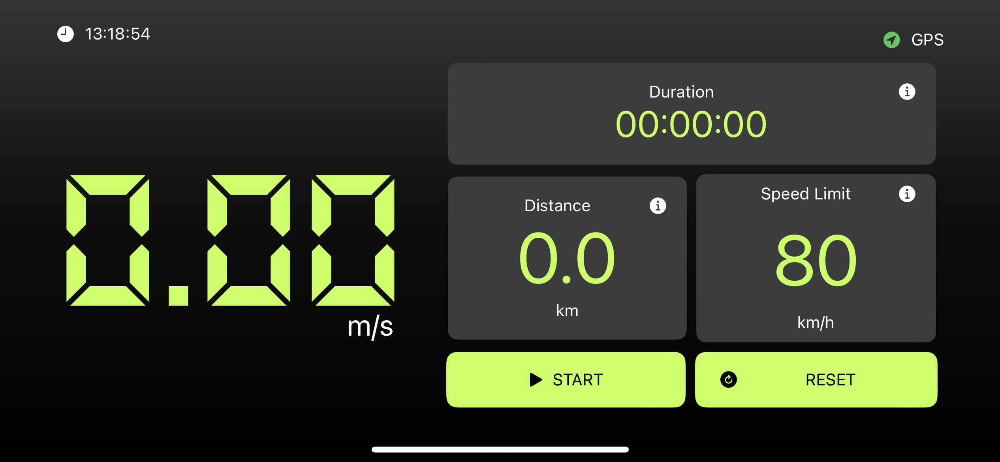

# Speedometer

Speedometer app provides an accurate real-time speed readings built using Swift/SwiftUI and CoreLocation frameworks.

## Features

- **Speed Tracking:** Get precise speed measurements based on GPS data, ensuring you always know how fast you're going.
- **Distance Tracking:** Seamlessly track your route and monitor your speed changes as you travel.
- **Speed Limit Alerts:** Set custom speed limits and receive alerts when you exceed them, helping you stay within legal boundaries.
- **Optimized for iOS:** Designed for seamless integration with iOS devices, including support for the latest iPhones and iPads.

## Screenshots



## Getting Started

To run Speedometer on your external device, follow these steps:

1. **Clone the repository:**

   ```bash
   git clone https://github.com/sirdarvs/ios-speedometer.git
   
2. **Open the project in Xcode:**
- Navigate to the project directory:
   ```bash
   cd SimulationApp
- Open the Xcode project file:
   ```bash
   open SimulationApp.xcodeproj

3. **Build and run the application:**
- Choose a simulator or connect a physical device to your Mac.
- Press the "Run" button in Xcode or use the shortcut Cmd + R.
  
4. **Explore Speedometer:**
  
- Once the application is running, interact with the ECG-like chart.

## Dependencies

None (Pure Swift/SwiftUI project).

## Contributing

Contributions are welcome! Feel free to open issues or submit pull requests to enhance Speedometer.
